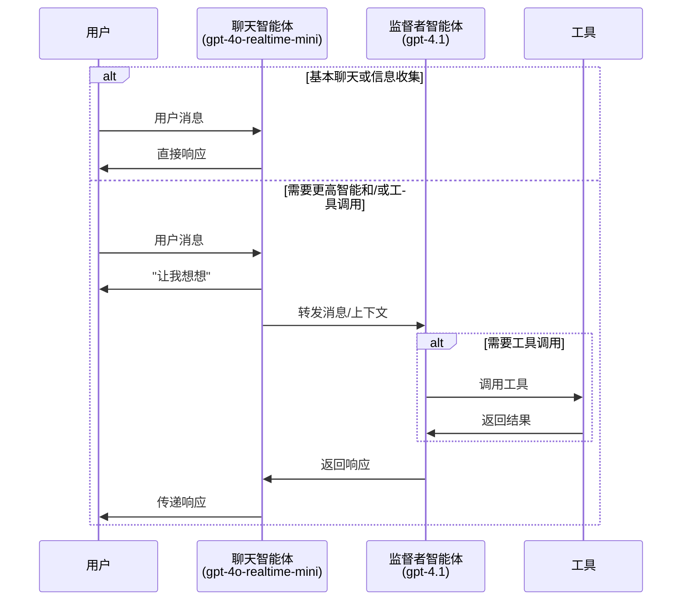
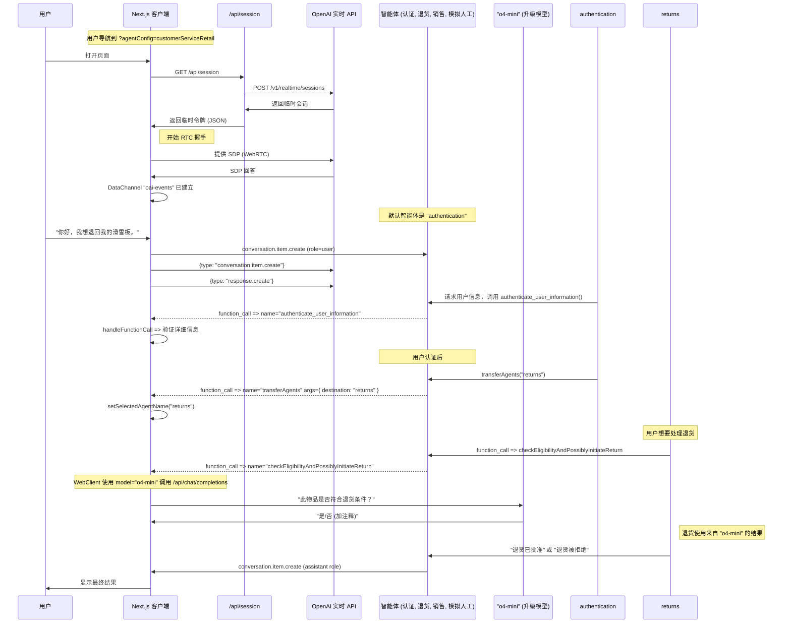

# 实时 API 智能体演示

这是一个演示语音智能体高级模式的项目，使用 OpenAI 实时 API 和 OpenAI 智能体 SDK。

## 关于 OpenAI 智能体 SDK

本项目使用 [OpenAI 智能体 SDK](https://github.com/openai/openai-agents-js)，这是一个用于构建、管理和部署高级 AI 智能体的工具包。该 SDK 提供：

- 定义智能体行为和工具集成的统一接口
- 内置智能体编排、状态管理和事件处理支持
- 与 OpenAI 实时 API 的简易集成，实现低延迟流式交互
- 多智能体协作、移交、工具使用和防护栏的可扩展模式

完整文档、指南和 API 参考，请查看官方 [OpenAI 智能体 SDK 文档](https://github.com/openai/openai-agents-js#readme)。

**注意：** 如需不使用 OpenAI 智能体 SDK 的版本，请查看 [without-agents-sdk 分支](https://github.com/openai/openai-realtime-agents/tree/without-agents-sdk)。

主要演示两种模式：
1. **聊天监督者：** 基于实时的聊天智能体与用户交互并处理基本任务，而更智能的基于文本的监督者模型（如 `gpt-4.1`）广泛用于工具调用和更复杂的响应。这种方法提供了简单的入门方式和高质量的答案，但会稍微增加延迟。
2. **顺序移交：** 专业智能体（由实时 API 驱动）之间转移用户以处理特定的用户意图。这非常适合客户服务，用户意图可以由在特定领域表现出色的专业模型顺序处理。这有助于避免单个智能体包含所有指令和工具，这可能会降低性能。

## 🚀 安装设置

- 这是一个 Next.js TypeScript 应用。使用 `npm i` 安装依赖。
- 将你的 `OPENAI_API_KEY` 添加到环境中。可以添加到 `.bash_profile` 或等效文件中，或复制 `.env.sample` 为 `.env` 并在其中添加。
- 使用 `npm run dev` 启动服务器
- 在浏览器中打开 [http://localhost:3000](http://localhost:3000)。默认使用 `chatSupervisor` 智能体配置。
- 可以通过右上角的"场景"下拉菜单更换示例。

# 🌟 智能体模式 1：聊天监督者

此模式在 [chatSupervisor](src/app/agentConfigs/chatSupervisor/index.ts) 智能体配置中演示。聊天智能体使用实时模型与用户对话并处理基本任务，如问候用户、日常对话和收集信息，而更智能的基于文本的监督者模型（如 `gpt-4.1`）广泛用于处理工具调用和更具挑战性的响应。您可以通过根据需要将特定任务"选择加入"到聊天智能体来控制决策边界。

视频演示: [https://x.com/noahmacca/status/1927014156152058075](https://x.com/noahmacca/status/1927014156152058075)

## 示例

*在此交流中，注意收集电话号码的即时响应，以及延迟到监督者智能体处理工具调用和制定响应。"给我一点时间检查一下"说完和"感谢等待。您的上次账单..."开始之间大约有2秒钟。*

## 流程图


## 优势
- **更简单的入门。** 如果您已有高性能的基于文本的聊天智能体，可以将相同的提示和工具集提供给监督者智能体，并对聊天智能体提示进行一些调整，您将拥有一个与文本智能体性能相当的自然语音智能体。
- **简单升级到完整实时智能体**：无需将整个智能体切换到实时 API，您可以一次移动一个任务，花时间验证并建立对每个任务的信任，然后部署到生产环境。
- **高智能性**：您的语音智能体受益于 `gpt-4.1` 等模型的高智能性、出色的工具调用和指令遵循能力。
- **更低成本**：如果您的聊天智能体仅用于基本任务，您可以使用 realtime-mini 模型，即使与 GPT-4.1 结合使用，也应该比使用完整的 4o-realtime 模型更便宜。
- **用户体验**：与缝合模型架构相比，这是更自然的对话体验，响应延迟通常在用户说话结束后 1.5 秒或更长时间。在此架构中，模型立即响应用户，即使需要依赖监督者智能体。
  - 但是，更多助手响应将以"让我想想"开始，而不是立即以完整响应回应。

## 为您自己的智能体进行修改
1. 更新 [supervisorAgent](src/app/agentConfigs/chatSupervisorDemo/supervisorAgent.ts)。
  - 如果您已有现有文本智能体提示和工具，请添加它们。这应该包含您语音智能体逻辑的"核心"，并非常具体地说明它应该/不应该做什么以及如何准确响应。在 `==== 特定领域智能体指令 ====` 下方添加此信息。
  - 您可能应该更新此提示以更适合语音，例如简洁的指令并避免长项目列表。
2. 更新 [chatAgent](src/app/agentConfigs/chatSupervisor/index.ts)。
  - 使用您自己的语调、问候语等自定义 chatAgent 指令。
  - 将您的工具定义添加到 `chatAgentInstructions`。我们建议使用简短的 yaml 描述而不是 json，以确保模型不会混淆并尝试直接调用工具。
  - 您可以通过向 `# 允许操作的许可列表` 部分添加新项目来修改决策边界。
3. 为了降低成本，尝试将 `gpt-4o-mini-realtime` 用于 chatAgent 和/或将 `gpt-4.1-mini` 用于监督者模型。为了在特别困难或高风险任务上最大化智能性，考虑权衡延迟并向监督者提示添加思维链，或使用使用 `o4-mini` 的附加推理模型基础监督者。

# 🔄 智能体模式 2：顺序移交

此模式受 [OpenAI Swarm](https://github.com/openai/swarm) 启发，涉及专业智能体之间的用户顺序移交。移交由模型决定并通过工具调用协调，可能的移交在智能体图中明确定义。移交触发带有新指令和工具的 session.update 事件。此模式有效处理各种用户意图与专业智能体，每个智能体可能有长指令和众多工具。

这里有一个[视频演示](https://x.com/OpenAIDevs/status/1880306081517432936)展示其工作原理。您应该能够使用此仓库在不到 20 分钟内原型化您自己的多智能体实时语音应用！


*在这个简单示例中，用户从问候智能体转移到俳句智能体。请参见下方此流程的简单完整配置。*

`src/app/agentConfigs/simpleExample.ts` 中的配置
```typescript
import { RealtimeAgent } from '@openai/agents/realtime';

// 使用 OpenAI 智能体 SDK 定义智能体
export const haikuWriterAgent = new RealtimeAgent({
  name: 'haikuWriter',
  handoffDescription: '编写俳句的智能体。', // agent_transfer 工具的上下文
  instructions:
    '询问用户主题，然后回复关于该主题的俳句。',
  tools: [],
  handoffs: [],
});

export const greeterAgent = new RealtimeAgent({
  name: 'greeter',
  handoffDescription: '问候用户的智能体。',
  instructions:
    "请问候用户并询问他们是否想要俳句。如果是，移交给 'haikuWriter' 智能体。",
  tools: [],
  handoffs: [haikuWriterAgent], // 定义此智能体可以移交给哪些智能体
});

// 智能体集合只是参与场景的智能体数组
export default [greeterAgent, haikuWriterAgent];
```

## 客户服务零售流程

这是一个更复杂、代表性的实现，说明了客户服务流程，具有以下功能：
- 更复杂的智能体图，包含用户认证、退货、销售和用于升级的占位符人工智能体。
- [退货](https://github.com/openai/openai-realtime-agents/blob/60f4effc50a539b19b2f1fa4c38846086b58c295/src/app/agentConfigs/customerServiceRetail/returns.ts#L233)智能体升级到 `o4-mini` 来验证和启动退货，作为高风险决策的示例，使用与上述类似的模式。
- 提示模型遵循状态机，例如准确收集姓名和电话号码并逐字符确认以验证用户。
  - 要测试此流程，说您想退回您的滑雪板并完成必要的提示！

[src/app/agentConfigs/customerServiceRetail/index.ts](src/app/agentConfigs/customerServiceRetail/index.ts) 中的配置。
```javascript
import authentication from "./authentication";
import returns from "./returns";
import sales from "./sales";
import simulatedHuman from "./simulatedHuman";
import { injectTransferTools } from "../utils";

authentication.downstreamAgents = [returns, sales, simulatedHuman];
returns.downstreamAgents = [authentication, sales, simulatedHuman];
sales.downstreamAgents = [authentication, returns, simulatedHuman];
simulatedHuman.downstreamAgents = [authentication, returns, sales];

const agents = injectTransferTools([
  authentication,
  returns,
  sales,
  simulatedHuman,
]);

export default agents;
```

## 流程图

此图表说明了在 `src/app/agentConfigs/customerServiceRetail/` 中定义的更高级交互流程，包括详细事件。

<details>
<summary><strong>显示客户服务零售流程图</strong></summary>



</details>

# 📋 其他信息

## 下一步
- 您可以复制这些模板来制作自己的多智能体语音应用！一旦您制作了新的智能体集配置，请将其添加到 `src/app/agentConfigs/index.ts`，您应该能够在 UI 的"场景"下拉菜单中选择它。
- 每个 agentConfig 可以定义指令、工具和 toolLogic。默认情况下，所有工具调用只返回 `True`，除非您定义 toolLogic，它将运行您的特定工具逻辑并向对话返回对象（例如检索的 RAG 上下文）。
- 如果您想使用 customerServiceRetail 中显示的约定（包括定义状态机）来创建自己的提示，我们在[这里](src/app/agentConfigs/voiceAgentMetaprompt.txt)包含了元提示，或者您可以使用我们的 [语音智能体元提示 GPT](https://chatgpt.com/g/g-678865c9fb5c81918fa28699735dd08e-voice-agent-metaprompt-gpt)

## 输出防护栏
助手消息在 UI 中显示之前会检查安全性和合规性。防护栏调用现在直接位于 `src/app/App.tsx` 内：当 `response.text.delta` 流开始时，我们将消息标记为 **IN_PROGRESS**，一旦服务器发出 `guardrail_tripped` 或 `response.done`，我们分别将消息标记为 **FAIL** 或 **PASS**。如果您想更改审核的触发或显示方式，请在 `App.tsx` 内搜索 `guardrail_tripped` 并调整那里的逻辑。

## 导航 UI
- 您可以在场景下拉菜单中选择智能体场景，并使用智能体下拉菜单自动切换到特定智能体。
- 对话记录在左侧，包括工具调用、工具调用响应和智能体更改。点击展开非消息元素。
- 事件日志在右侧，显示客户端和服务器事件。点击查看完整负载。
- 在底部，您可以断开连接、在自动语音活动检测或 PTT 之间切换、关闭音频播放和切换日志。

## Pull Requests

欢迎提交 issue 或 pull request，我们会尽力审查。此仓库的精神是演示新智能体流程的核心逻辑；超出此核心范围的 PR 可能不会被合并。

# 👥 核心贡献者
- Noah MacCallum - [noahmacca](https://x.com/noahmacca)
- Ilan Bigio - [ibigio](https://github.com/ibigio)  
- Brian Fioca - [bfioca](https://github.com/bfioca)